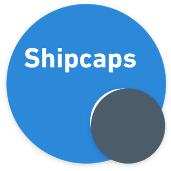
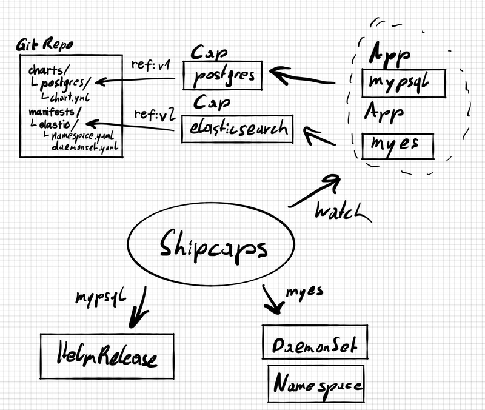

# Shipcaps [](https://gitter.im/shipcaps/community?utm_source=badge&utm_medium=badge&utm_campaign=pr-badge&utm_content=badge)

<p align="center">
	
</p>

A meta layer for kubernetes applications. Shipcaps provides a meta layer over various awsome packaging tools and projects. 
With our Custom Resources, we represent *providing* ("[Cap](#cap-capability)") a kubernetes application, and *using* ("[App](#app-application)") a kubernetes application in a 
normalized fashion. We embrace kubernetes' ecosystem diversity and are normalizing operations with various existing 
tools and do not aim to replace them.

Table of Contents
=================

* [Idea](#idea)
* [Design](#design)
 * [Cap ("Capability")](#cap-capability)
    * [Inputs](#inputs)
    * [Values](#values)
    * [Source](#source)
       * [Types](#types)
    * [Dependencies](#dependencies)
 * [CapDep ("Capability Dependency")](#capdep-capability-dependency)
 * [App ("Application")](#app-application)

## Idea

Maintaining a kubernetes offering for any type of organisation can be a challange. In order to minimize the knowledge 
required to run a service on kubernetes, a couple of tools emerge(d) to solve the problem of packaging Applications.
Those packages consist of a number of kubernetes native resources, and are handled as a whole via Helm, Kustomize, Ship, 
ManifestBundle, CosmicEgg or FluxCapacitor, in their various specific ways.

Kubernetes Engineers/SREs/DevOpsEngineers usually are trained to deal with those formats the same way a Golang Developer 
knows how to handle `go.mod`, `Gopkg.toml` and `glide.yaml`, or a Java Developer knows how to tame `pom.xml` and
`build.gradle`. So we know how to come up with `values.yaml`, `kustomize.yaml`, etc. but sometimes also have the need to
interface with our peers on our platforms that might not have this skillset.

**The idea for *Shipcaps* is to separate the development, tuning and providing of kubernetes-native Applications
and the usage/comsumption of packaged kubernetes applications by users in a normalized fashion.** 

Scenario 1:
In Acme, Corp. I want to provide a common platform for services for my product. Can I provide teams with a common way to
get their dependencies? Do we need to get compliance/security clearance if Microservice A uses acme/postgres-chart and 
Mircoservice B a postgres operator?

Scenario 2:
In Acme, Corp. we want to cut resource costs. As an SRE I'm currently going through all deployments and am streamlining 
resource issues and autoscaling. I can only do that because I am efficient using 4 different packaging tools. Could this
streamlining have been done by the users themselves? 

Scenario 3:
In Acme, Corp. we want a constant overview over deployments for compliance and security reasons. How does this inventory
look like? Can I just list all currently running applications, and inspect their parts if an audit comes? GitOps maybe? 

Scenario 4:
In Acme, Corp. we want to allocate team's budgets based on whether they provide value for other teams. Team A plans to 
create a custom postgres chart. Team B, C, D and E need postgres too. Do I have to pay for development if I'm managing 
Team A? Can I relay development costs to thos other teams somehow? 

Scenario 5:
In Acme, Corp. we want to have one or more repositories of kubernetes-native applications, goverened by a distributed
body. Do I have a corporate-wide registry of them? I might have a couple of helm chart registries, and a couple of 
common kustomize repos. But utilizing it, I still need some domain knowledge to utilize and explore those. Is there a 
technical representation for this, that I can act upon and inventorize?

**Conclusion**

Those are **awesome** scenarios already. We're getting stuff done in potentially cross-functioning teams, and we're 
packaging clusters of kubernetes resources into logical units, We're even going towards having a single source of truth 
with little magic between commit and deployment! Arriving here means you're probably already doing loads of cool stuff.

## Design

In Shipcaps we're dealing with 2 different kinds. A `Cap` as in "Capability", and an `App` as in "Application".



### Cap/ClusterCap ("Capability")

See [examples/simplecap.yaml](./examples/simplecap.yaml).

A `Cap`/`ClusterCap`(cluster-wide; exactly same) defines a packaged kubernetes application. This can be a couple of 
manifests with maybe a couple of placeholder-values for environment-specific config, or a Helm Chart checked into some 
common git repository I want to feed some custom values to, or something entirely different. Caps are cluster-wide.

With a `Cap` you can refer to a source and define what inputs it still needs on instatiation and define additional 
values.

Usage:
```yaml
apiVersion: shipcaps.redradrat.xyz/v1beta1
kind: Cap
metadata:
  name: acme-es
spec:
  inputs: # Inputs are defined here
  values: # Values are defined here
  source:
    type: __TYPE_GOES_HERE__
    ...
  dependencies: # Dependencies are defined here
    ...
```

#### Inputs

Inputs define a set of values the will have to be given, when creating an [`App`](#app-application) from this `Cap`.

An input consists of:
 * **key**: used to map with provided values in [App](#app-application))
 * **type**: used to validate and parse the content of a provided value
    * `string`: The type of this input will be parsed as string (e.g. "string")
    * `stringlist`: The type of this input will be parsed as a list of strings (e.g. ["string1", "string2"])
    * `int`: The type of this input will be parsed as an integer (e.g. 42)
    * `float`: The type of this input will be parsed as an float (e.g. 42.00)
 * **targetId**: the id that will be available for rendering the underlying [source](#source) 

```yaml
spec:
  inputs:
    - key: nsname
      type: string
      targetId: namespacename
  values:
    - value: "teststring"
      targetId: teststring
  ...
```

#### Values

Values define a set of values the will be passed on to render the defined source. Most probably used for defaulting.

A value consists of :
 * **targetId**: the id that this value will be available as, for rendering the underlying [source](#source) 
 * **value**: the actual value content (e.g. "string")

```yaml
spec:
  values:
    - value: "teststring"
      targetId: teststring
  ...
```

#### Source

Each Cap refers to underlying source, which represents a packaged kubernetes deployment. Again, this project does not aim to replace existing tooling but only be an 
abstraction of "value in, application out" usecases.

There is multiple ways the underlying sources can be referred to:

* repo

The Git Repo material is really the embodyment of our GitOps strategy. With this material spec we can refer to an 
existing git repo or a subdirectory in it, and expect our [type](#types)-specific sources at this location.

Usage:
```yaml
...
spec:
    type: ...
    repo:
      uri: https://github.com/redradrat/charts
      ref: v1.0
      path: /elasticsearch
      auth:
        username:
          secretKeyRef:
            name: repoauth
            key: repo-username
        password: 
          secretKeyRef:
            name: repoauth
            key: repo-password
```

* inline

The inline source spec is a quick-and-easy way to abstract a single or a couple of manifests into a Cap.

Usage:
```yaml
...
spec:
    type: ...
    inline:
    - apiVersion: v1
    kind: Namespace
    metadata:
    name: es
    - apiVersion: elasticsearch.k8s.elastic.co/v1
    kind: Elasticsearch
    metadata:
      name: my-elasticsearch
      namespace: es
    spec:
      version: 7.6.2
      nodeSets:
      - name: default
        count: 1
      ...
```

##### Types

There are various different *types* of sources. They all represent different ways of templating, generating or otherwise 
compinling manifests or input towards the kube-apiserver. With caps we just want to come up with a list of values to 
pass on to our "backend", the actual tool used to generate.

Usage:
```yaml
apiVersion: shipcaps.redradrat.xyz/v1beta1
kind: CapSource
metadata:
  name: acme-es
spec:
  type: __TYPE_GOES_HERE__
  ...
```

**Supported types**:

* simple

The `simple` Cap type refers to plain kubernetes manifests enriched with simple placeholder-replacement functionality.

Usecases:
* Single or few ready-made manifests, to be applied to various environments. (Domain name, varying)
* Operator Deployment coupled with CRDs
* ...

Supported sources:
* inline

* helmchart

The `helmchart` Cap type refers to a helm chart and allows to defines a set of inputs. This type expects the the 
[helm-operator](https://github.com/fluxcd/helm-operator/) to be available.

Supported sources:
* repo

#### Dependencies

A Cap can also define a list of dependencies `CapDeps`, that serve as prerequesites for the described package. The 
defined [`CapDep`] sources will be rendered and applied before the actual `Cap` source.

A use-case for this could be: Deploying an operator (defined via `CapDep`) before deploying a CustomResource (defined 
as `Cap`). 

### CapDep ("Capability Dependency")

See [examples/simplecapdep.yaml](./examples/simplecapdep.yaml)

A `CapDep` defines a set of sources that serve as prerequisites of a `Cap`. It defines a source package and values it 
requires. CapDeps are cluster-wide.

Usage:
```yaml
apiVersion: shipcaps.redradrat.xyz/v1beta1
kind: CapDep
metadata:
  name: acme-es-operator
spec:
  values: # Values are defined here
  source:
    type: __TYPE_GOES_HERE__
    ...
```

### App ("Application")

See [examples/simpleapp.yaml](./examples/simpleapp.yaml)

An `App` defines an instance of a `Cap`. It references the `Cap` and defines the values it requires. After being 
reconciled by the shipcaps operator, the application will be usable.

`capRef` and `clusterCapRef` are not combinable. If you define both, and `capRef` will take precedence.

Usage:
```yaml
apiVersion: shipcaps.redradrat.xyz/v1beta1
kind: App
metadata:
  name: myelastic
  namespace: here
spec:
  capRef: # Should not be defined if clusterCapRef is used
    name: acme-es
    namespace: caps
  clusterCapRef: # Should not be defined if capRef is used
    name: acme-es
  values:
    - key: dbname
      value: mydb
```

#### Values

An app can define values, that will be mapped with the required [inputs](#inputs) of the referenced 
[Cap](#cap-capability). 

A value consists of:
 * **key**: used to map with required [inputs](#inputs) in [Cap](#cap-capability))
 * **value**: the actual value content (e.g. "string")
 
 ```yaml
spec:
  ...
  values:
    - key: dbname
      value: "mydbname"
```